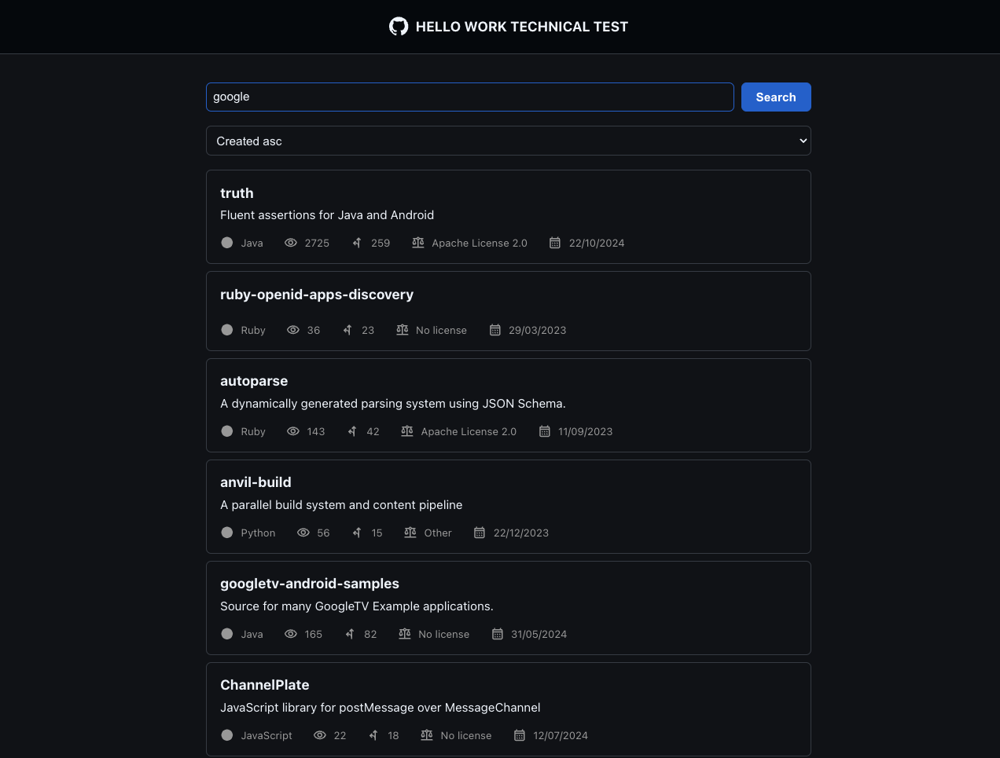

# Technical test fullstack

## Description

This project is a technical test for a frontend developer position at hellowork.

## Run the project

To run the project

then `npm install` and `npm run start`, client will be available at `http://localhost:3000` or another port if 3000 is already taken.

You will be limited to 60 requests per hour, if you want to increase this limit you can create a `.env` file (or copy the .env.dist file) and add your github token in the `REACT_APP_GITHUB_API_TOKEN` variable.
To create a token, go to your github account settings, then developer settings, then personal access tokens and generate a new token.

## Features

Asked:

- search repositories by organization name
- display a list of repositories with their name, description, number of stars and number of forks etc..
- clickable card to display more details about the repository
- display a list of contributors with their name and number of contributions
- cached data to reduce the amount of requests and optimize the performance
- pagination when more than 10 repositories are found
- select that allow to sort the repositories by name, created, updated etc ..

Bonus:

- Design inspired by the real black theme github application

